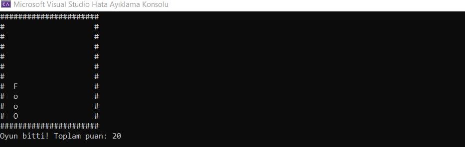

# Yılan Oyunu Uygulaması

Bu C++ programı, klasik bir yılan oyununu simüle eder. Kullanıcı, klavye girişi ile yılanı yönlendirir ve meyve yiyerek puan kazanmaya çalışır. Ancak yılanın kendi vücudu veya ekranın sınırlarıyla çarpışması durumunda oyun sona erer.

## Nasıl Çalışır?

- `SnakeGame` sınıfı, oyunun ana mantığını içerir ve oyun döngüsünü çalıştırır.
- Yılanın başı (`head`) ve vücudu (`tail`) ayrı ayrı izlenir.
- Klavye girişleri (`_kbhit` ve `_getch`) ile kullanıcıdan alınır.
- Oyun durumu ekrana `draw` fonksiyonu ile çizilir.
- Yılanın hareketi ve çarpışma kontrolleri gerçekleştirilir.
- Puan, meyve yendiğinde artar.
- Oyun döngüsü, `runGame` fonksiyonu içinde devam eder.

## Örnek Kullanım

```cpp
#include <iostream>
#include <conio.h>
#include <vector>
#include <cstdlib>
#include <ctime>

int main() {
    const int width = 20;
    const int height = 10;

    SnakeGame snakeGame(width, height);
    snakeGame.runGame();

    return 0;
}
```

**Bu örnek, yılan oyununu başlatan bir programı içerir. Oyunun boyutları (width ve height) belirlenerek, yılan oyunu başlatılır.**


# Dikkat Edilmesi Gerekenler
- Oyunun başında yılanın hareketi yoktur. Kullanıcı bir tuşa basana kadar bekler.
- Yılanın hareketi, klavyeden alınan tuşlara göre belirlenir.
- Windows için `Sleep` fonksiyonu kullanılarak oyunun hızı kontrol edilir.


# Ekran Resmi


# Bilgilendirme
**---------------------------------------------------------**
| Herkese Açık | Geliştirilebilir | Zyra Software|
|---------|---------|---------|
| Açık | Geliştirilebilir |@zyrasoftware |

